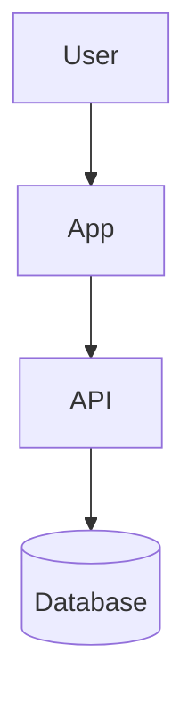
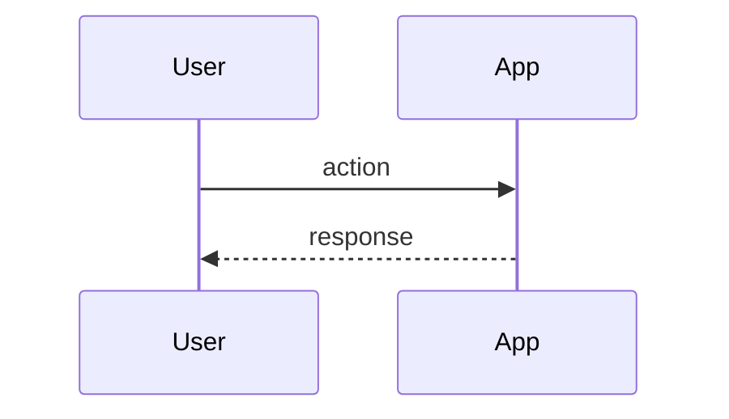

# 02 — Design: <Project Name>

> Status: Draft | Last updated: <YYYY-MM-DD>
> References: docs/01-spec.md

## 1. Architecture / Stack Options

Propose 2–3 options with tradeoffs *unless the user stated a hard preference*.
If they did, design around it and note any tradeoffs worth flagging.

### Option A — <name>
- **Summary:** <one line>
- **Tradeoffs:** cost <…>, complexity <…>, scalability <…>, team fit <…>

### Option B — <name>
- **Summary:** <one line>
- **Tradeoffs:** cost <…>, complexity <…>, scalability <…>, team fit <…>

### Chosen option & rationale
- **Chosen:** <Option X> — record once the user picks/confirms.
- **Why:** <reasoning>

## 2. Tech Stack

| Layer | Choice | Notes |
|-------|--------|-------|
| Frontend | <…> | |
| Backend | <…> | |
| Data | <…> | |
| Infra / hosting | <…> | |

## 3. Architecture Diagram

## 4. Additional Diagrams

*(Add sequence / data-flow diagrams for non-trivial interactions.)*

## 5. Key Design Decisions

- <decision> — <rationale>
