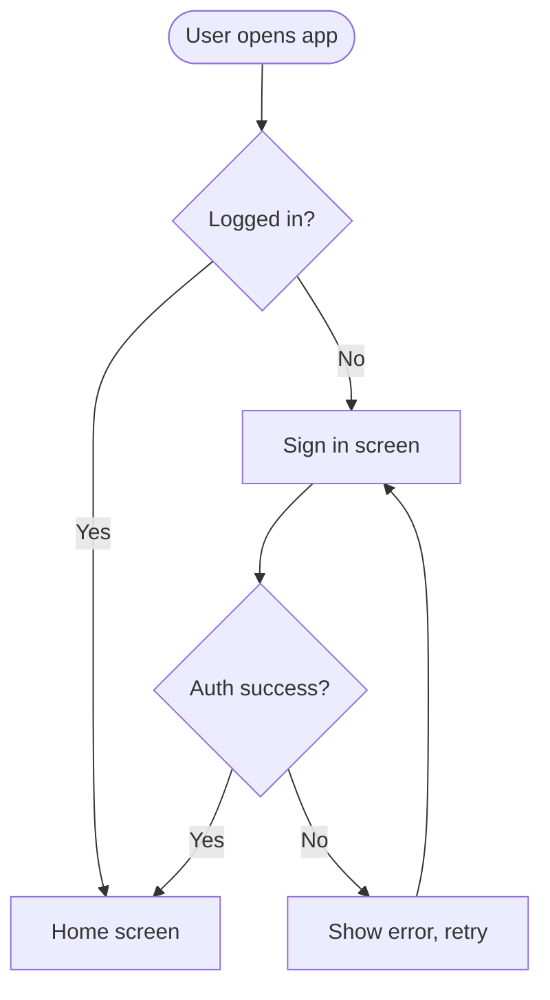

# User flow diagrams (Mermaid patterns)

Use `graph TD` (top-down) or `graph LR` (left-right) flowcharts for user flows. One diagram per core flow.

## Basic flow

## Conventions

- `([Rounded])` for start/end states
- `[Rectangle]` for screens/pages
- `{Diamond}` for decisions/branches
- Always include at least one error or edge-case path per flow where realistic (failed validation, empty state, network error) — flows that only show the happy path are incomplete.
- Label edges with the action or condition that causes the transition (`-->|Tap "Submit"|`), not just arrows.
- Keep one flow per diagram. If a flow is large, split it into a main diagram plus sub-flow diagrams (e.g. "Checkout flow" and "Checkout — payment failure sub-flow") rather than cramming everything into one unreadable graph.

## Flow to screen linkage

Each node in the flow diagram that represents a screen should have a matching entry in the screens section (Unit 3) using the same name, so the flow and screen descriptions stay traceable to each other.